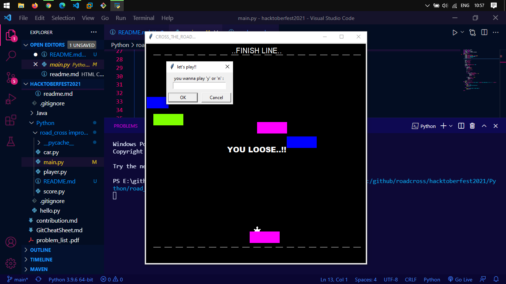

# The ROAD_CROSSING GAME...

## What is it?
-> There is a road in which cars are moving randomly and your job is to cross the road.

### Functionalities
- turtle can only move forwards.
- you can control the turtle via your up-arrow key.

### Made with
- Basic knowledge python.
- the turtle module in python.

### Look at it
> 
